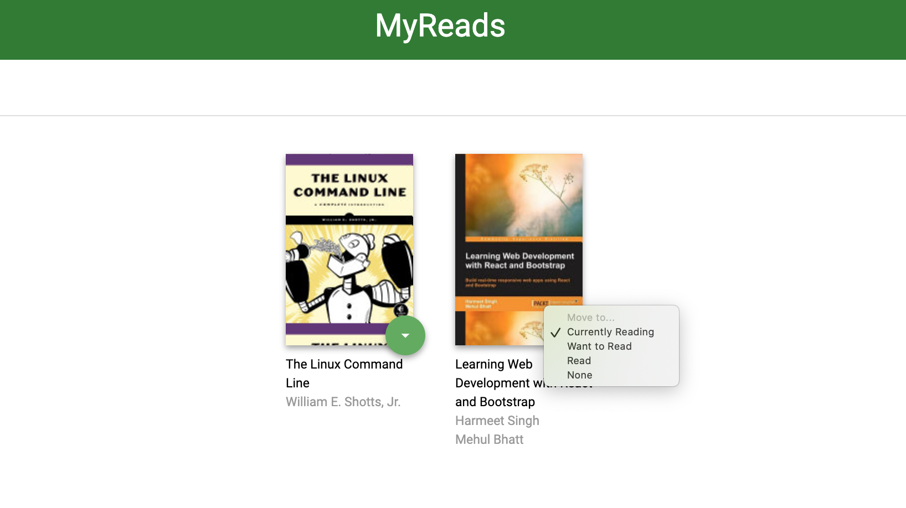

# MyReads Project

This bookshelf application was developed as part of the Udacity React Nanodegree Program.  

It allows you to select and categorize books you have read, are currently reading, or want to read. 
You can also search for books using a predefined list of keywords, and add books to your bookshelf from those search results.

## Installing the App
### Node
This application was developed using Node.js, version v13.11.0.  
Just go to the [official Node.js website](https://nodejs.org/) and download the installer.
Also, be sure to have `git` available in your PATH, `npm` might need it (You can find git [here](https://git-scm.com/)).

### Bookshelf Application
* Clone or download this project: `git clone https://github.com/hdatteln/reactnd-project-myreads-starter.git` 
* In the project's root directory, run `npm install` to install the required packages


## Running the App
* In the project's root directory, run `npm start` to start the application.
* A new browser window should automatically open and display the app. If it doesn't, navigate to http://localhost:3000/ in your browser.

## Using the App
### Bookshelf (http://localhost:3000/)
The bookshelf consists of three areas:
* Currently Reading
* Want to Read
* Read

You can use the control buttons on each displayed book in order to move a book from one section to another (Want to Read/Read/Currently Reading), or to remove it from the bookshelf view by selecting 'None'

  


### Search (http://localhost:3000/search)
In the input search box at the top of the page, enter one of the following search terms:

```'Android', 'Art', 'Artificial Intelligence', 'Astronomy', 'Austen',   
'Baseball', 'Basketball', 'Bhagat', 'Biography', 'Brief', 'Business',  
'Camus', 'Cervantes', 'Christie', 'Classics', 'Comics', 'Cook', 'Cricket', 'Cycling',   
'Desai', 'Design', 'Development', 'Digital Marketing', 'Drama', 'Drawing', 'Dumas',   
'Education', 'Everything', 
'Fantasy', 'Film', 'Finance', 'First', 'Fitness', 'Football', 'Future', 
'Games', 'Gandhi', 
'Homer', 'Horror', 'Hugo', 
'Ibsen', 'iOS',
'Journey', 
'Kafka', 'King', 
'Lahiri', 'Larsson', 'Learn', 'Literary Fiction', 
'Make', 'Manage', 'Marquez', 'Money', 'Mystery', 
'Negotiate', 
'Painting', 'Philosophy', 'Photography', 'Poetry', 'Production', 'Programming', 
'React', 'Redux', 'River', 'Robotics', 'Rowling', 
'Satire', 'Science Fiction', 'Shakespeare', 'Singh', 'Swimming', 
'Tale', 'Thrun', 'Time', 'Tolstoy', 'Travel', 
'Ultimate', 
'Virtual Reality', 
'Web Development'
```

You can use the control buttons on each displayed book in order to move it into one of your bookshelf areas (Want to Read/Read/Currently Reading);


## Resources and Documentation:

- [Create-react-app Documentation](https://github.com/facebookincubator/create-react-app)
- [React Router Documentation](http://knowbody.github.io/react-router-docs/)
- [React Training/React Router](https://reacttraining.com/react-router/web/api/BrowserRouter)
- [React API](https://facebook.github.io/react/docs/react-api.html)

## Udacity Resources:

- [Project starter template](https://github.com/udacity/reactnd-project-myreads-starter)
- [Project Rubric](https://review.udacity.com/#!/rubrics/918/view)
- [Udacity CSS Style Guide](http://udacity.github.io/frontend-nanodegree-styleguide/css.html)
- [Udacity HTML Style Guide](http://udacity.github.io/frontend-nanodegree-styleguide/index.html)
- [Udacity JavaScript Style Guide](http://udacity.github.io/frontend-nanodegree-styleguide/javascript.html)

